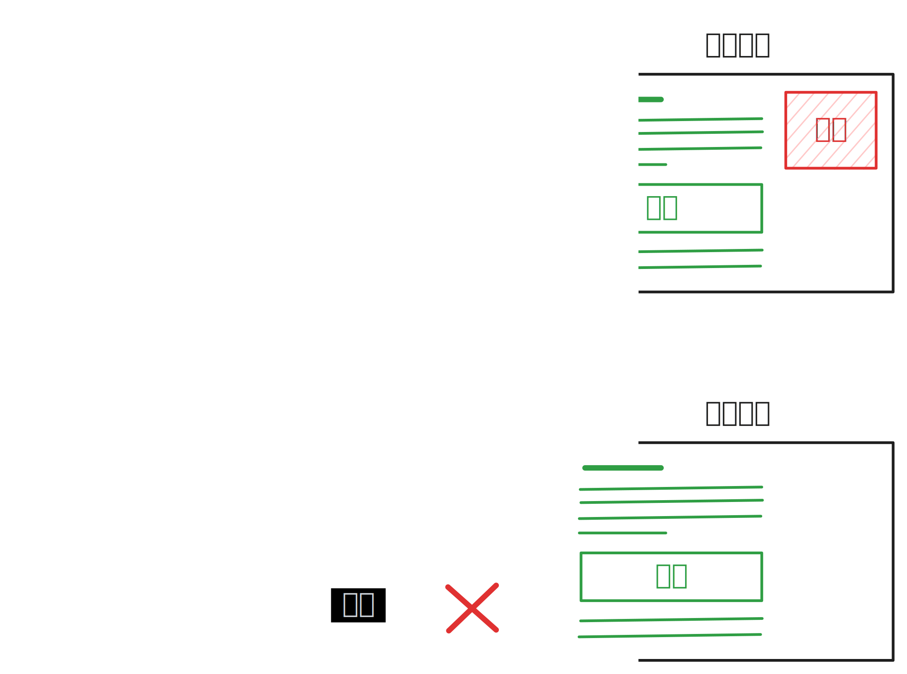

# 秋风广告规则是什么？

秋风广告规则是**针对网络请求的广告过滤列表**，拥有极致的体积控制和超高的命中率，是当前众多优秀广告规则的上游。

> [!important]
>
> 如果你是第一次接触广告规则，**请务必完整认真阅读本页面以及相关教程**，这不仅能帮助你快速且正确地使用上秋风广告规则、节约你的时间精力，还能减轻我们的负担。
>
> 如果你想支持我们的工作，欢迎 [赞助我们](./donate)，同时也欢迎感兴趣的小伙伴一起来维护本规则和这个文档。
>

## 针对网络请求？

广告与其他内容一样，都是通过互联网下载下来的。因此，只需要**阻断与广告相关的网络请求**，即可消除广告。

秋风广告规则便是这样的广告过滤规则：它记录了广告请求的「特征」，使得软件能够从海量的网络请求中识别出广告请求并执行阻断。

这样做的好处是，广告根本不会下载，在让体验变得清爽的同时，还可以**节省流量**。

同时，秋风广告规则的体积控制良好（仅数百条）、命中率高，意味着在识别广告时**效率更高、开销更低，**反应在使用体验上就是**更省电量，且在低配置的设备上也能运行**。

如果你有能力，还可以将其部署在家庭路由器上，实现更无感的无广告体验。

> [!note]
>
> 你可能已经在使用基于网络请求的广告拦截器了！
>
> 大部分**去广告浏览器插件**均内置了网络请求过滤器，如 AdBlock Plus、uBlock Origin 等。

## 相比于其他拦截方式？

Android 手机上有一些**基于无障碍**的广告跳过软件（李跳跳、GKD 等）。其工作原理是监听屏幕内容，并在出现广告弹窗或页面时模拟手指点击关闭按钮。**由于需要全时段监听屏幕内容，此类软件要消耗较多电量，且有潜在的安全隐患**。此外，由于广告实际上还是加载了，仍然会一闪而过，且仍在耗费相应流量。但其上手门槛低

如果你的 Android 手机有 Root 权限，还有一些**基于 Xposed 的**广告过滤模块。这些模块相应速度优秀，但是需要的前期开发工作量大（需要解包应用或 SDK，找到对应逻辑并移除），常常更新不及时，且通用性差。不仅如此，获取 Root 并非易事，上手门槛较高。

## 注意事项

在使用前，请注意：

1. 本规则**不考虑广告奖励机制**（例如观看广告解锁内容）。
2. 本规则可能会导致某些系统的特定功能失效。这些功能通常未经用户同意便上传一些隐私信息，我们认为阻断这些功能是合理的。如有需要，也可以自行手动放行。（例如 [#38](https://github.com/TG-Twilight/AWAvenue-Ads-Rule/issues/38)）
3. 本规则以**高命中率**和**体积可控**为目标，不可能涵盖所有广告域名，介意勿用。

> 事实上，没有任何广告规则可以做到涵盖所有广告域名，特别是一些百万级的规则，在其看似唬人的庞大规则数背后，是**臃肿至极的体积**和**超低的命中率**，不仅**大幅拖慢上网速度**，其 **95% 以上**的规则更是一年下来都无法命中，相信我。
> —— Twilight

## 准备开始！

正如其名，秋风广告规则**只是一个规则**，**本身并不具备广告拦截能力**。你需要**安装网络过滤软件之后导入（订阅）本规则**才能起到效果。

我们针对许多网络过滤工具都做了适配并撰写了教程。你可以前往 [使用教程](./tutorial) 页面选择一个网络过滤工具并开始。

如果你已经很熟悉某个工具，也可以直接前往 [地址列表](./links) 找到你使用的软件然后导入订阅地址。

## 订阅之后……

### 你的支持就是我们的动力！

如果可以，请给我们点一个免费的 star: [AWAvenue-Ads-Rule](https://github.com/TG-Twilight/AWAvenue-Ads-Rule)

我的 GitHub 主页还有一些有趣的内容，说不定你喜欢呢？点个 [Follow](https://github.com/TG-Twilight) 吧！

最后，也欢迎你访问我的博客—— [**秋风塬上**](https://awads.cc/)

记录了不少我和我的朋友们瞎折腾的经验谈，和一些个人的思考与随笔。

### 使用过程中有问题？

广告遗漏、误杀、规则请求等，欢迎通过 [Issue 页面](https://github.com/TG-Twilight/AWAvenue-Ads-Rule/issues) 提出。

想聊聊、提建议，或者只是想和大家聊聊天？我们也非常欢迎！加入我们的 Telegram 群组：[秋風がく山道](https://t.me/AWAvenueAdsChat)

  

